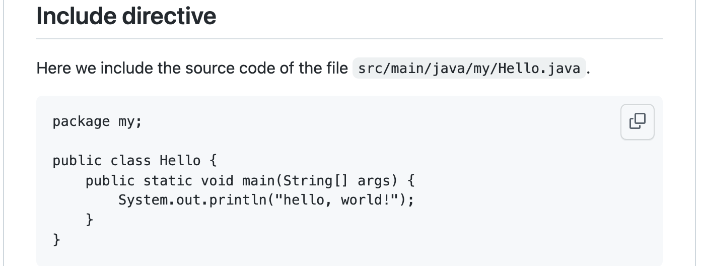

= Include directive is not supported in Github-flavored Asciidoc --- a workaround

== Problem to solve

In a GitHub repository, you can make a file named `README.adoc` in https://asciidoc-py.github.io/index.html[Asciidoc] format. GitHub is able to convert Asciidoc text to HTML runtime so that it renders in browsers. A sample is here:

- https://github.com/kazurayam/IncludeIsNotSupportedInGithubFlavoredAsciidoc-a_workaround/blob/master/article.adoc[article.adoc]

This looks very nice! You can enjoy the Asciidoc capabilities to author your documents and publish them in GitHub.
However, there is a caveat in GitHub Flavored Asciidoc. *GitHub Flavored Asciidoc (GFA) does not support the `include::path/to/file[]` directive.* See the subsection titled "Include directive" at the tail of https://github.com/kazurayam/IncludeIsNotSupportedInGithubFlavoredAsciidoc-a_workaround/blob/master/article.adoc[article.adoc].

I intended to embed the source code of my Java program into the article for reference. I expected to see something as follows.

I need the Include directive in Asciidoc. Seriously! The include directive is the very reason why I want to use Asciidoc, instead of Markdown, to author the README doc of my software projects on GitHub. 

Why GitHub does not support Include directive in Asciidoc? --- There is a discussion about it, which was opened 4 years ago and still remain open.

- https://github.com/github/markup/issues/1095[Asciidoctor: support include directives for other asciidoc files #1095]

As far as I learned from this discussion, it seems unlikely that GitHub adds Include directive support in GFA in future. Very disappointing. Any workaround?

== Solution

In https://github.com/github/markup/issues/1095[the discussion], @chevdoor posted a workround at 9th June 2021.

