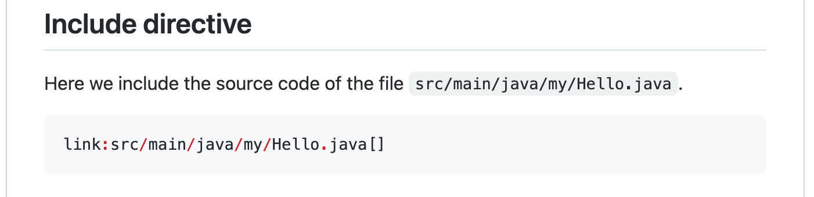
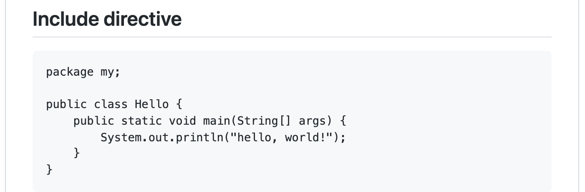

= Include directive is not supported in Github-flavored Asciidoc ---- a workaround proposed

== Problem to solve

In a GitHub repository, you can make a file named `README.adoc` in https://asciidoc-py.github.io/index.html[Asciidoc] format. GitHub is able to convert Asciidoc text to HTML runtime so that it renders in browsers. You can enjoy the Asciidoc capabilities to author your documents and publish them in GitHub. A sample is here:

- https://github.com/kazurayam/IncludeIsNotSupportedInGithubFlavoredAsciidoc-a_workaround/blob/master/article.adoc[article.adoc]

However, there is a caveat in GitHub Flavored Asciidoc. *GitHub Flavored Asciidoc (GFA) does not support the `include::path/to/file[]` directive.* See the subsection titled "Include directive" at the tail of https://github.com/kazurayam/IncludeIsNotSupportedInGithubFlavoredAsciidoc-a_workaround/blob/master/article.adoc[article.adoc].

This is not what I wanted to see! I wanted the code embedded into the document, as follows.

I need the Include directive in my README documents in Asciidoc on GitHub. Seriously! The include directive is the very reason why I want to use Asciidoc, instead of Markdown.

Why GitHub does not support Include directive in Asciidoc? --- There is a discussion about it, which was opened 4 years ago and still remain open.

- https://github.com/github/markup/issues/1095[Asciidoctor: support include directives for other asciidoc files #1095]

As far as I learned from this discussion, it seems unlikely that GitHub adds the Include directive support in future. Is there any workaround?

== Solution

In https://github.com/github/markup/issues/1095[the discussion], @chevdoor posted a workaround at 9th June 2021. Here I will quote his post entirely for easier reference.

[quote, 'https://github.com/github/markup/issues/1095[Asciidoctor: support include directives for other asciidoc files #1095]']
----
This is by far my favorite workaround although it requires a little setup and tooling.
Install pandoc and asciidoctor, you can then create a new (executable) .gti/hooks/pre-commit file with the following content:

#!/usr/bin/env bash

# convert all the files in the root
find . -iname "*.adoc" -type f -maxdepth 1 -not -name "_*.adoc" | while read fname; do
  target=${fname//adoc/md}
  xml=${fname//adoc/xml}
  echo "converting $fname into $target"

  asciidoctor -b docbook -a leveloffset=+1 -o - "$fname" | pandoc  --markdown-headings=atx --wrap=preserve -t markdown_strict -f docbook - > "$target"
  echo deleting $xml
  rm -f "$xml"
done

# if we find a readme*.md, we rename to README.md
find . -iname "readme*.md" -not -name "README.md" -type f -maxdepth 1 | while read fname; do
  echo Renaming $fname to README.md
  mv $fname README.md
done

The script will look for all the adoc files in the root of your project (except those starting with _) and convert them. Since github picks the asciidoc by default when you have both a README.adoc and a README.md 🤦 , I have to further get my README.adoc out of the way renaming to README_src.adoc) and add extra renaming to the script.

To cheer us up, this option comes with a small benefit: your asciidoc is now linted before you ever commit, so you will spot wrong includes paths before your commit makes it in.
----

This worked for me! So I decided to introduce it into my projects.

== Description

I will describe here what I have done to author https://github.com/kazurayam/IncludeIsNotSupportedInGithubFlavoredAsciidoc-a_workaround/blob/master/README.md[README of this repository].

=== Environment

- machine: Mac Book Air
- OS: macOS Monterey v12.0.1

=== External dependencies

==== pandoc

I needed https://pandoc.org/[pandoc], a universal document converter. I installed pandoc using [Homebrew](https://brew.sh/).

[source]
----
$ brew install pandoc
----

==== asciidoctor

I need https://asciidoctor.org/[asciidoctor], A fast text processor & publishing toolchain for converting AsciiDoc to HTML5, DocBook & more. I installed asciidoctor using Homebrew.

[source]
----
$ brew install asciidoctor
----

=== shell script

I added a shell script named link:readmeconv.sh[<projectDir>/readmeconv.sh] in the root directory. It contains the code which @chevdoor proposed.

I changed the mode of this file _executable_.

[source]
----.
$ chmod +x ./readmeconv.sh
----

=== Git hook

I edited the `<projectDir>/.git/hooks/pre-commit` so that it executes the `readmeconv.sh` script on `git commit`.

[source,shell]
----
include::.git/hooks/pre-commit[]
----

=== You should name it as `REAMDE_.adoc`, rather thann `README.adoc`

The official GitHub doc https://docs.github.com/en/repositories/managing-your-repositorys-settings-and-features/customizing-your-repository/about-readmes[About READMEs] says:

[quote]
----
If you put your README file in your repository's root, docs, or hidden .github directory, GitHub will recognize and automatically surface your README to repository visitors.
----

So, what if you have 2 files `README.adoc` and `README.md` together in the repository's root, which file will be rendered when you visit the top page? --- I examined and found out that `README.adoc` wins, `README.md` won't be surfaced. If I make a `README.adoc` file to generate `README.md`, yes, it works. But GitHub won't choose the `README.md`. It will choose the `README.adoc`. I do not like this to happen. How can I overcome this problem?

*You should name your Asciidoc document as `README_.adoc`* with a meaningless underbar character appended. The `readmeconv.sh` script can convert the `README_.adoc` file into `README.md`. GitHub will not choose `README_.adoc` as the repositories README; it will find `README.md` and happily surface it to us. 

== Conclusion

The `include` directive makes it far easier and enjoyable writing documents of software projects. With `include`, I do not have to copy the lines of code from the program sources into the README document; I do not have to be worried about forgetting to re-copy&paste after the program sources are updated. The workaroud by @chevdoor worked for me. It enabled me to author README documents of my GitHub repositories in Asciidoc.
